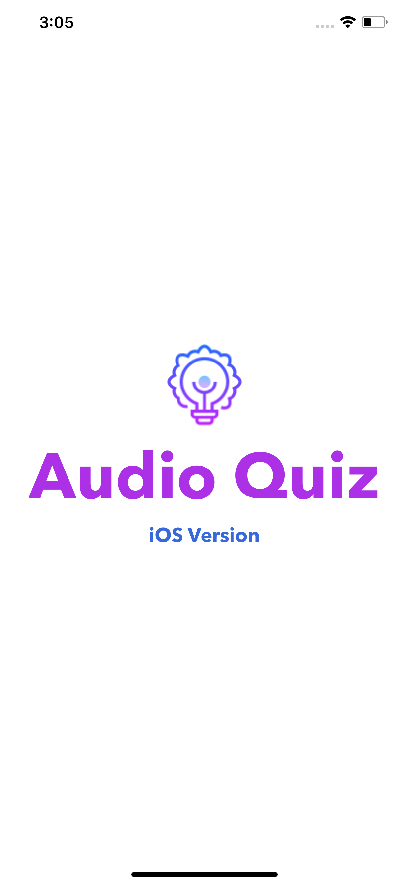
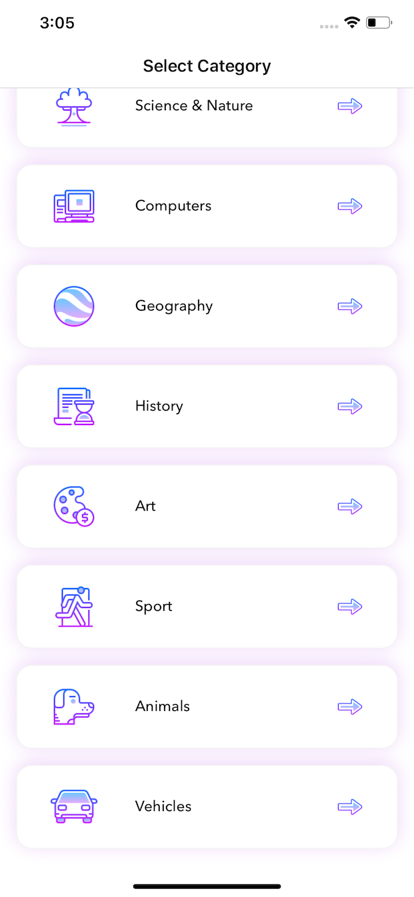
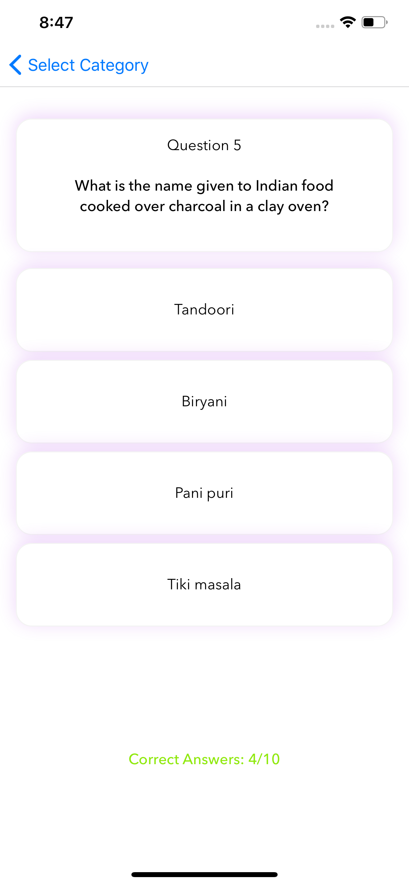
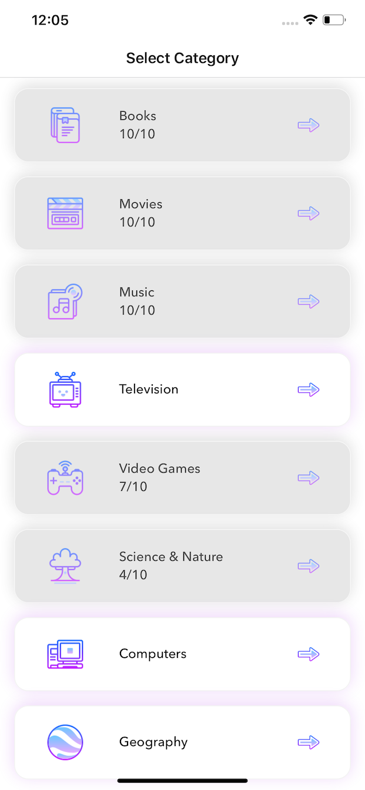
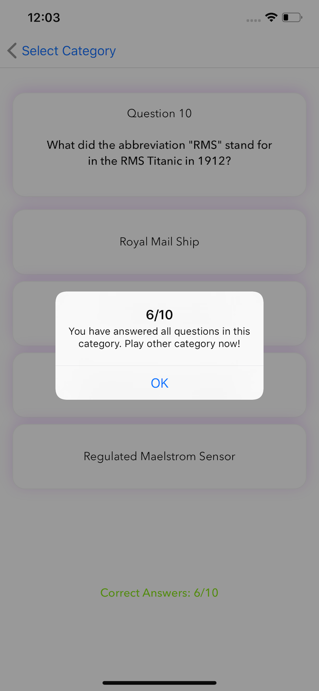
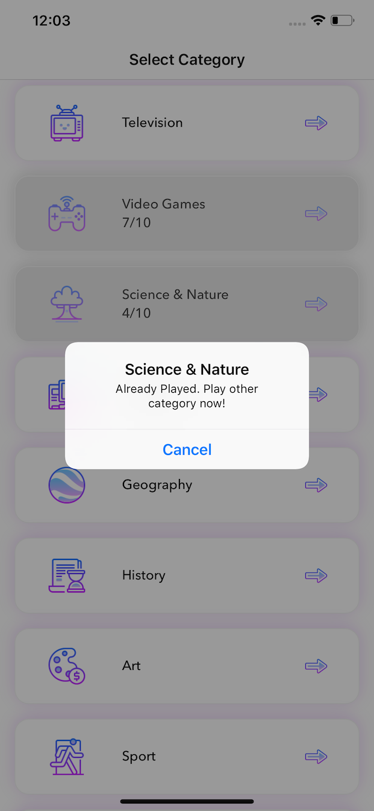

# ReactNative-AudioQuiz

Audio Quiz is a cross-platform multi-screen quiz app which blind & non-blind users can play using speech controls or standard tap gestures. The categories, questions, and options are dictated so that blind users can also enjoy the game. 

### Screenshots 

      

After playing the quiz the scores are stored and locked. Pop up is displayed after completing the quiz and if trying to play already played quiz.

      

### Used

* React Native
* Expo
* ObjectiveC Xcode
* Java AndroidStudio
* JavaScript CSS

