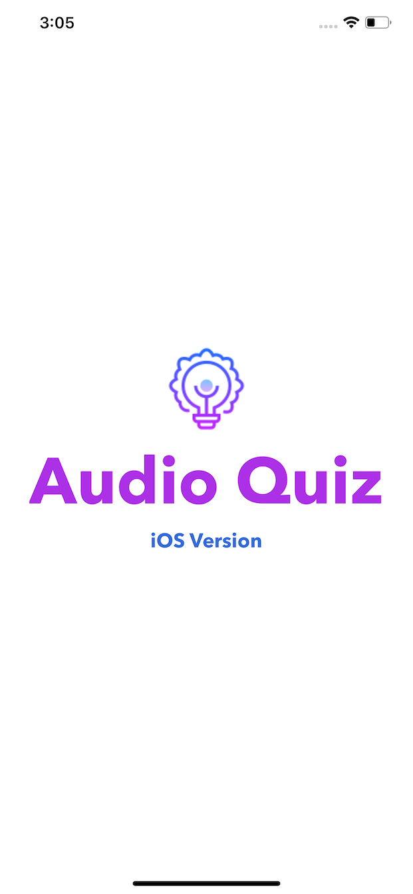
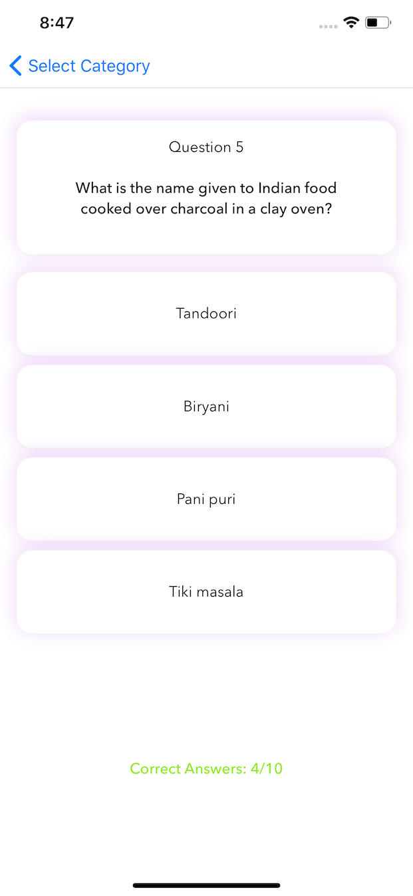

# ReactNative-AudioQuiz

Audio Quiz is a cross-platform multi-screen quiz app which blind & non-blind users can play using speech controls or standard tap gestures. The categories, questions, and options are dictated so that blind users can also enjoy the game. 

### Screenshots 

      

The quiz questions and options are sent to GoogleTTS with a proper pause in the string and then the base64 fetched from the response is parsed to the audio file to speak the question and options in shuffled order. After playing the quiz the scores are stored and locked in persistent storage. Pop up is displayed after completing the quiz and if trying to play already played quiz.

Tap & Speak Answer button allows users to speak the option and the recorded file is then converted to base64 string and is sent for recognition to Google STT and then the test is matched.

      

### Used

* React Native
* Expo
* ObjectiveC Xcode
* Java AndroidStudio
* JavaScript CSS
* Google Text-to-Speech
* Google Speech-to-Text

